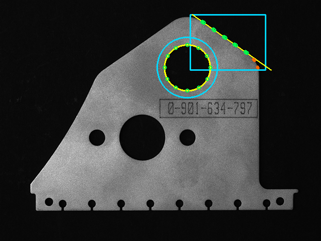

# EdgesGauging.jl

[](https://schrpe.github.io/EdgesGauging.jl/stable)
[](https://schrpe.github.io/EdgesGauging.jl/dev)
[](https://github.com/schrpe/EdgesGauging.jl/actions/workflows/Tests.yml)
[](https://github.com/schrpe/EdgesGauging.jl/actions/workflows/Documentation.yml)
[](https://github.com/invenia/BlueStyle)

Sub-pixel edge detection and robust geometric fitting (lines, circles) for
machine-vision gauging tasks, written in pure Julia.

## What it does

- **1-D edge detection** in intensity profiles, with Gaussian smoothing and
  parabolic sub-pixel interpolation of gradient extrema. NaN-tolerant — works
  on profiles padded with NaN at the ends.
- **2-D edge detection** across rectangular ROIs, multi-strip scans, and
  radial / ring scans from a reference point.
- **Profile extraction along arbitrary paths** — sample an image along a line
  segment or a circular arc with selectable interpolation (nearest / bilinear /
  bicubic), configurable strip width, and explicit `NaN` for out-of-bounds
  samples.
- **Robust geometric fitting** via a generic RANSAC engine with constraint
  support (angle, radius, arc completeness, inlier counts).

## Install

```julia
] add https://github.com/schrpe/EdgesGauging.jl
```

(Once registered in the General registry: `] add EdgesGauging`.)

## Example: line and circle on a real part

Using the test image [`test/blob.tif`](test/blob.tif) — a 480×640 grayscale
photograph of a metal plate — we demonstrate `gauge_line` on the slanted right
edge and `gauge_circle` on the upper round hole.

```julia
using FileIO, Images, Random, EdgesGauging

Random.seed!(0)                       # RANSAC samples randomly — fix the seed
                                      # so these numbers reproduce.
img = Float64.(Gray.(load("test/blob.tif")))

# Line gauge — slanted right edge of the part
line_fit = gauge_line(
    img, (30, 380, 140, 530), LEFT_TO_RIGHT,
    15.0,                         # strip spacing (px)
    3,                            # strip thickness (px)
    2.0,                          # sigma  – Gaussian smoothing
    0.05;                         # threshold – min |gradient|
    polarity = POLARITY_NEGATIVE, # bright metal → dark background
    selector = SELECT_BEST,
)

# Circle gauge — round hole near the top of the part
cc = CircleConstraints{Float64}(min_radius = 20.0, max_radius = 70.0)
circle_fit = gauge_circle(
    img, (135.0, 374.0),          # rough centre estimate (row, col)
    0.0, 2π,                      # full 360°
    deg2rad(30.0),                # angular step between rays
    60,                           # ray length (must exceed true radius)
    2.0, 0.05;                    # sigma, threshold
    polarity    = POLARITY_POSITIVE,   # ray dark hole → bright metal
    selector    = SELECT_BEST,
    constraints = cc,
    refine      = true,           # geometric LM refinement
)
```

Output (run via `julia --project=docs docs/generate_readme_example.jl`):

```
─ Line fit ────────────────────────────────────────────────
  A,B,C    = 0.575, -0.8181, -196.45
  angle    = 35.1° (from +x axis)
  inliers  = 15 / 21

─ Circle fit ──────────────────────────────────────────────
  centre (col,row) = (374.163, 135.715)
  radius (px)      = 45.654
  inliers          = 13 / 13
```

The fitted line is reported in **normalised implicit form** `A·x + B·y + C = 0`
with `A² + B² = 1` and `(x, y) = (col, row)`. The normalisation makes
`|A·x + B·y + C|` the perpendicular distance (in pixels) from any point
`(x, y)` to the line — that is exactly the residual RANSAC uses for inlier
classification.
`(A, B)` is the unit normal of the line; `(-B, A)` is its tangent direction,
so the orientation reported as `angle` is `atan(A, -B)` wrapped into
`[-90°, 90°]`.

The line ROI is positioned so the lower strips graze the slant→vertical
transition of the part's right edge — those strips deviate from the straight
line and become the 6 RANSAC outliers shown in the overlay.

The annotated overlay below shows every layer of the pipeline:

| Layer                       | Colour              |
|:--------------------------- |:------------------- |
| Measurement windows         | cyan                |
| RANSAC inlier edge points   | green hollow rings  |
| RANSAC outlier edge points  | filled orange disc  |
| Fitted line / fitted circle | yellow              |



## Profile extraction along arbitrary paths

`extract_line_profile` and `extract_arc_profile` sample image intensity along
a straight segment or a circular arc, returning a 1-D `Vector{Float64}` ready
to feed into `gauge_edges_in_profile`:

```julia
# Slim profile across a feature, then sub-pixel edge detection
p = extract_line_profile(img, (row0, col0), (row1, col1);
                         width=1, interp=INTERP_BICUBIC)
r = gauge_edges_in_profile(p, 2.0, 10.0, POLARITY_POSITIVE, SELECT_BEST)

# Wider strip averages 5 parallel samples — useful when the feature is
# slightly tilted or noisy
p_strip = extract_line_profile(img, p0_rc, p1_rc; width=5)

# Arc-length-uniform sampling along an arc (auto-density)
p_arc = extract_arc_profile(img, (row_c, col_c), 40.0, 0.0, π/2)
```

Out-of-bounds samples are emitted as `NaN`. `gauge_edges_in_profile` is
NaN-tolerant: NaN-padded profiles flow straight through and the edge is
still found in the valid interior.

## Conventions

- Image arrays are `(row, col)` — matching Julia's column-major indexing.
- `center_rc` and segment-endpoint arguments are therefore `(row, col)` tuples.
- **Integer index = pixel centre.** `image[i, j]` is the value at
  `(row, col) = (i, j)`; the pixel itself spatially covers
  `(i-0.5, j-0.5)` … `(i+0.5, j+0.5)`. Sample positions outside
  `(0.5, 0.5)`…`(nrows+0.5, ncols+0.5)` yield `NaN`.
- Detected edges in `ImageEdge` are exposed as Cartesian `(x = col, y = row)`
  for consumers that prefer image-space coordinates.

## Error handling

`gauge_line` and `gauge_circle` throw `GaugingError` with a `reason::Symbol`
field when a pipeline fails:

- `:too_few_points` — edge detection produced fewer points than the fitter
  requires.
- `:ransac_failed` — RANSAC could not find a model satisfying the supplied
  constraints (radius range, angle range, arc completeness, …).

Catch on `e.reason` to branch on the failure mode:

```julia
try
    fit = gauge_circle(img, (row, col), 0, 2π, deg2rad(3), 80, 2.0, 0.1)
catch e
    e isa GaugingError && e.reason === :too_few_points || rethrow()
    # fall back to a coarser threshold / larger ROI / …
end
```